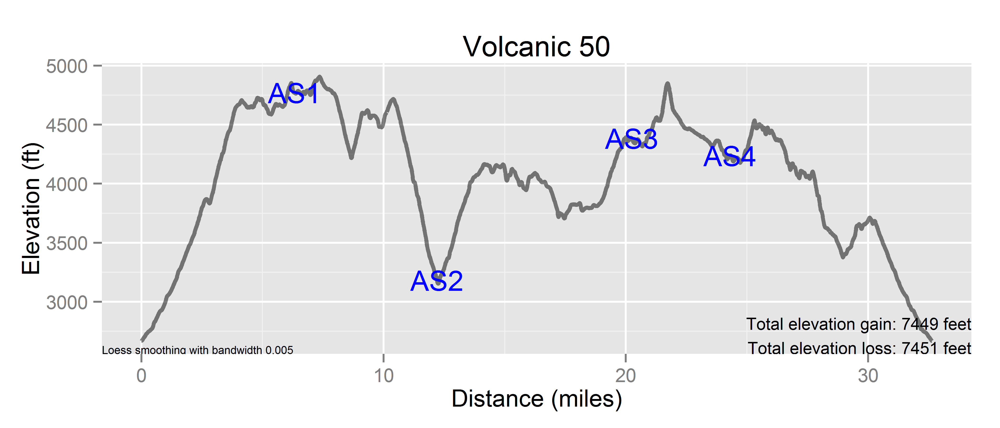

# Volcanic 50
Benjamin Chan  

Course map for the [Volcanic 50](https://gobeyondracing.com/races/volcanic-50/).
GPS data was acquired during the 2014 race, held on September 6, 2014.

2014-09-21 22:48:03

R version 3.1.1 (2014-07-10)


Load the GPX file.
The source of the GPX data was a Suunto Ambit 2R.
The data was recorded on 9/6/2014.


```r
require(plotKML, quietly=TRUE)
f <- file.path(getwd(), "Volcanic 50.gpx")
D <- readGPX(f)
tracks <- D$tracks[[1]][[1]]
```

Find the geometric mean of the coordinates in the GPX file.


```r
require(geosphere, quietly=TRUE)
gmean <- geomean(tracks[, c("lon", "lat")])
gmean
```

```
##           x     y
## [1,] -122.2 46.19
```

Calculate distances.
Use the Haversine algorithm.


```r
require(geosphere, quietly=TRUE)
tracks$distIncremental <- 0
p1 <- tracks[1:nrow(tracks)-1, c("lon", "lat")]
p2 <- tracks[2:nrow(tracks), c("lon", "lat")]
tracks$distIncremental[2:nrow(tracks)] <- distHaversine(p1, p2) / 1000
tracks$distCumulative <- cumsum(tracks$distIncremental)
```

Convert distance from kilometers to miles.


```r
tracks$distCumulativeMiles <- tracks$distCumulative * 0.621371
```

Convert elevation from meters to feet.


```r
tracks$ele <- as.numeric(tracks$ele) * 3.28084
```

Smooth the elevation data.
The bandwidth parameter was set using trial-and-error.
Use LOESS.


```r
bw <- 0.005
# smoothed <- ksmooth(tracks$distCumulativeMiles, tracks$ele, "normal", bandwidth=bw)
# tracks$eleSmoothed <- smoothed$y
smoothed <- loess(ele ~ distCumulativeMiles, tracks, span=bw)
tracks$eleSmoothed <- predict(smoothed)
```

Calculate elevation gain.


```r
tracks$eleChange <- NA
tracks$eleChange[2:nrow(tracks)] <- tracks$eleSmoothed[2:nrow(tracks)] - tracks$eleSmoothed[1:nrow(tracks)-1]
tracks$eleGain <- pmax(tracks$eleChange, 0)
tracks$eleLoss <- -pmin(tracks$eleChange, 0)
```

Create aid station annotations.
Aid stations are at miles 6.32, 12.2, 20.25, 24.3.


```r
as <- c(6.32, 12.2, 20.25, 24.3)
as1 <- tracks[which(abs(tracks$distCumulativeMiles - as[1]) == min(abs(tracks$distCumulativeMiles - as[1]))), ]
as2 <- tracks[which(abs(tracks$distCumulativeMiles - as[2]) == min(abs(tracks$distCumulativeMiles - as[2]))), ]
as3 <- tracks[which(abs(tracks$distCumulativeMiles - as[3]) == min(abs(tracks$distCumulativeMiles - as[3]))), ]
as4 <- tracks[which(abs(tracks$distCumulativeMiles - as[4]) == min(abs(tracks$distCumulativeMiles - as[4]))), ]
aidStations <- rbind(as1, as2, as3, as4)
aidStations$as <- paste0("AS", seq(1, length(as)))
```

Print course statistics.


```r
totalGain <- sum(tracks$eleGain, na.rm=TRUE)
totalLoss <- sum(tracks$eleLoss, na.rm=TRUE)
message(sprintf("Total distance: %.2f kilometers\nTotal elevation gain: %.0f feet\nTotal elevation loss: %.0f feet",
                sum(tracks$distIncremental, na.rm=TRUE),
                totalGain,
                totalLoss))
```

```
## Total distance: 52.51 kilometers
## Total elevation gain: 7449 feet
## Total elevation loss: 7451 feet
```

Fix a stupid bug in get_map.
See [ggmap stamen watercolor png error](http://stackoverflow.com/a/24301510).
Shouldn't need to do this with ggmap 2.4.


```r
require(ggmap)
get_stamenmap <- function (bbox = c(left = -95.80204, bottom = 29.38048, right = -94.92313, 
    top = 30.14344), zoom = 10, maptype = c("terrain", "watercolor", 
    "toner"), crop = TRUE, messaging = FALSE, urlonly = FALSE, 
    filename = "ggmapTemp", color = c("color", "bw"), ...) 
{
    require(jpeg)
    args <- as.list(match.call(expand.dots = TRUE)[-1])
    argsgiven <- names(args)
    if ("bbox" %in% argsgiven) {
        if (!(is.numeric(bbox) && length(bbox) == 4)) {
            stop("bounding box improperly specified.  see ?get_openstreetmap", 
                call. = F)
        }
    }
    if ("zoom" %in% argsgiven) {
        if (!(is.numeric(zoom) && length(zoom) == 1 && zoom == 
            round(zoom) && zoom >= 0 && zoom <= 18)) {
            stop("scale must be a postive integer 0-18, see ?get_stamenmap.", 
                call. = F)
        }
    }
    if ("messaging" %in% argsgiven) 
        stopifnot(is.logical(messaging))
    if ("urlonly" %in% argsgiven) 
        stopifnot(is.logical(urlonly))
    if ("filename" %in% argsgiven) {
        filename_stop <- TRUE
        if (is.character(filename) && length(filename) == 1) 
            filename_stop <- FALSE
        if (filename_stop) 
            stop("improper filename specification, see ?get_stamenmap.", 
                call. = F)
    }
    if ("checkargs" %in% argsgiven) {
        .Deprecated(msg = "checkargs argument deprecated, args are always checked after v2.1.")
    }
    maptype <- match.arg(maptype)
    color <- match.arg(color)
    if (is.null(names(bbox))) 
        names(bbox) <- c("left", "bottom", "right", "top")
    fourCorners <- expand.grid(lon = c(bbox["left"], bbox["right"]), 
        lat = c(bbox["bottom"], bbox["top"]))
    fourCorners$zoom <- zoom
    row.names(fourCorners) <- c("lowerleft", "lowerright", "upperleft", 
        "upperright")
    fourCornersTiles <- apply(fourCorners, 1, function(v) LonLat2XY(v[1], 
        v[2], v[3]))
    xsNeeded <- Reduce(":", sort(unique(as.numeric(sapply(fourCornersTiles, 
        function(df) df$X)))))
    numXTiles <- length(xsNeeded)
    ysNeeded <- Reduce(":", sort(unique(as.numeric(sapply(fourCornersTiles, 
        function(df) df$Y)))))
    numYTiles <- length(ysNeeded)
    tilesNeeded <- expand.grid(x = xsNeeded, y = ysNeeded)
    if (nrow(tilesNeeded) > 40) {
        message(paste0(nrow(tilesNeeded), " tiles needed, this may take a while ", 
            "(try a smaller zoom)."))
    }
    xTileProgression <- rep(1:numXTiles, numYTiles)
    yTileProgression <- rep(1:numYTiles, each = numXTiles)
    base_url <- "http://tile.stamen.com/"
    base_url <- paste(base_url, maptype, "/", zoom, sep = "")
    urls <- paste(base_url, apply(tilesNeeded, 1, paste, collapse = "/"), 
        sep = "/")
    urls <- paste(urls, ".jpg", sep = "")
    if (messaging) 
        message(length(urls), " tiles required.")
    if (urlonly) 
        return(urls)
    size <- 256 * c(length(xsNeeded), length(ysNeeded))
    map <- matrix("NA", nrow = size[2], ncol = size[1])
    destfile <- paste(filename, "jpg", sep = ".")
    for (k in seq_along(urls)) {
        download.file(urls[[k]], destfile = destfile, quiet = !messaging, 
            mode = "wb")
        tile <- readJPEG(destfile)
        if (color == "color") {
            tile <- apply(tile, 2, rgb)
        }
        else if (color == "bw") {
            tile_dim <- dim(tile)
            tile <- gray(0.3 * tile[, , 1] + 0.59 * tile[, , 
                2] + 0.11 * tile[, , 3])
            dim(tile) <- tile_dim[1:2]
        }
        map[(1 + 256 * (yTileProgression[k] - 1)):(256 * yTileProgression[k]), 
            (1 + 256 * (xTileProgression[k] - 1)):(256 * xTileProgression[k])] <- tile
    }
    bboxOfTile <- function(vXY) {
        lonlat_upperleft <- XY2LonLat(vXY[1], vXY[2], zoom)
        lonlat_lowerright <- XY2LonLat(vXY[1] + 1, vXY[2] + 1, 
            zoom)
        data.frame(left = lonlat_upperleft$lon, bottom = lonlat_lowerright$lat, 
            right = lonlat_lowerright$lon, top = lonlat_upperleft$lat)
    }
    tileBboxes <- ldply(split(tilesNeeded, 1:nrow(tilesNeeded)), 
        function(df) bboxOfTile(as.numeric(df)))
    mbbox <- c(left = min(tileBboxes$left), bottom = min(tileBboxes$bottom), 
        right = max(tileBboxes$right), top = max(tileBboxes$top))
    if (!crop) {
        map <- as.raster(map)
        class(map) <- c("ggmap", "raster")
        attr(map, "bb") <- data.frame(ll.lat = mbbox["bottom"], 
            ll.lon = mbbox["left"], ur.lat = mbbox["top"], ur.lon = mbbox["right"])
        return(map)
    }
    if (crop) {
        slon <- seq(mbbox["left"], mbbox["right"], length.out = size[1])
        slat <- seq(mbbox["top"], mbbox["bottom"], length.out = size[2])
        keep_x_ndcs <- which(bbox["left"] <= slon & slon <= bbox["right"])
        keep_y_ndcs <- which(bbox["bottom"] <= slat & slat <= 
            bbox["top"])
        croppedmap <- map[keep_y_ndcs, keep_x_ndcs]
    }
    croppedmap <- as.raster(croppedmap)
    class(croppedmap) <- c("ggmap", "raster")
    attr(croppedmap, "bb") <- data.frame(ll.lat = bbox["bottom"], 
        ll.lon = bbox["left"], ur.lat = bbox["top"], ur.lon = bbox["right"])
    croppedmap
}
require(jpeg)
require(plyr)
assignInNamespace("get_stamenmap", get_stamenmap, ns="ggmap")
```

Get map layer.


```r
# map <- get_map(location=gmean, maptype="terrain", source="stamen", zoom=16)
map <- get_map(location=gmean, maptype="hybrid", zoom=12)
```

```
## Map from URL : http://maps.googleapis.com/maps/api/staticmap?center=46.190394,-122.188071&zoom=12&size=%20640x640&scale=%202&maptype=hybrid&sensor=false
## Google Maps API Terms of Service : http://developers.google.com/maps/terms
```

Course map.


```r
ggmap(map, base_layer=ggplot(tracks, aes(x=lon, y=lat))) +
  geom_path(alpha=1/2, size=1, color="blue") +
  annotate("text", label="Start/Finish", x=tracks[1, "lon"], y=tracks[1, "lat"], color="white") +
  annotate("text", label=aidStations[, "as"], x=aidStations[, "lon"], y=aidStations[, "lat"], color="white") +
  labs(title="Volcanic 50") +
  theme(axis.text=element_blank(), axis.title=element_blank(), axis.ticks=element_blank(), legend.position="none")
```

 

Elevation chart.


```r
a1 <- sprintf("Total elevation gain: %.0f feet\nTotal elevation loss: %.0f feet",
              totalGain,
              totalLoss)
a2 <- sprintf("Loess smoothing with bandwidth %.3f", bw)
ggplot(tracks, aes(x=distCumulativeMiles, y=eleSmoothed)) +
  geom_line(alpha=1/2, size=1) +
  scale_x_continuous("Distance (miles)") +
  scale_y_continuous("Elevation (ft)") +
  annotate("text", label=aidStations$as, x=aidStations$distCumulativeMiles, y=aidStations$eleSmoothed, color="blue") +
  annotate("text", label=a1, x=Inf, y=-Inf, hjust=1, vjust=0, size=theme_get()$text[["size"]]/4) +
  annotate("text", label=a2, x=-Inf, y=-Inf, hjust=0, vjust=0, size=theme_get()$text[["size"]]/6) +
  labs(title="Volcanic 50") + 
  theme(legend.position="none")
```

 
